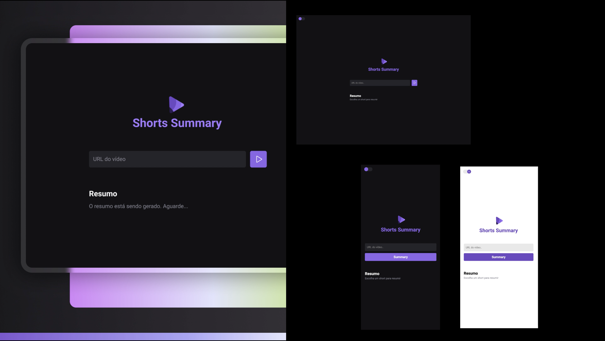

# Projeto Short Summary

O ShortsSummary é uma aplicação web que utiliza inteligência artificial para criar resumos de vídeos do YouTube Shorts de forma rápida e eficaz.

<p align="center">
  

<p align="center">
  
</p>
## Aprendizados

Com esse projeto pude criar uma aplicação onde codificamos o frontend e o backend para pegar um link de um vídeo shorts do youtube, baixamos o audio desse vídeo convertemos o audio enviamos para uma IA para transcrever essa audio e depois mandamos para outra IA fazer o resumo , implementei também um frontend responsivo e um a opcão de dark and ligth mode para o projeto.

## 🚀 Tecnologias

Esse projeto foi desenvolvido com as seguintes tecnologias:

- HTML, CSS, Javascript
- Node.js / Express.js
- Git e Github
- Figma

Outras Bibliotecas
Vite, Axios , Cors, ffmpeg

## 💻 Como executar o projeto

```bash
npm i
# para rodar o Frontend
npn run web
# para rodar o Backend
npm run server
```

## 🔖 Layout

Você pode visualizar o layout do projeto através [DESSE LINK](https://www.figma.com/community/file/1282823495335498952). É necessário ter conta no [Figma](https://figma.com) para acessá-lo.
